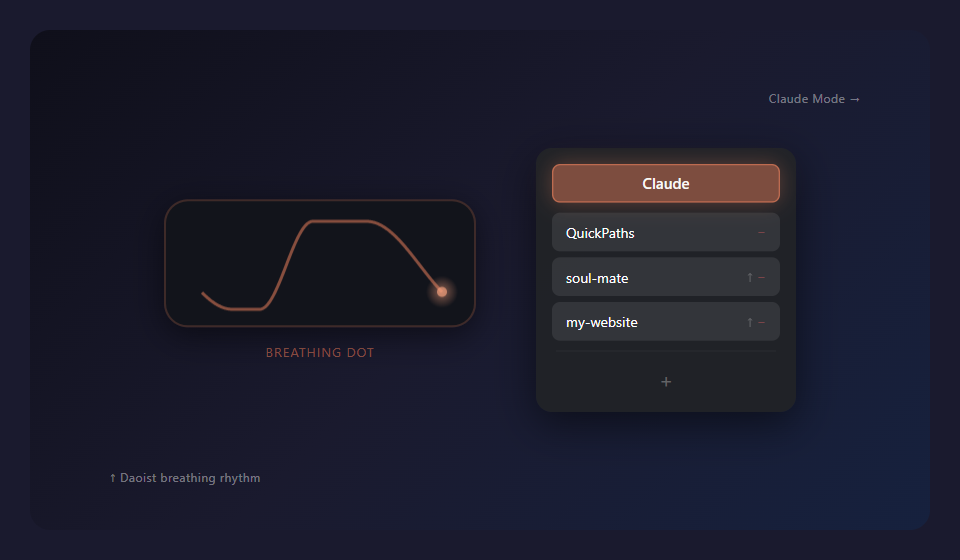

# QuickPaths

<p align="center">
  
</p>

Every Claude Code user knows the drill: find the project folder in Explorer, copy the path, open a terminal, `cd` there, type `claude`. Multiply that by a dozen projects a day.

QuickPaths pins your project paths to the desktop as a floating dot. Click the dot, click a project name — terminal opens, directory is set, `claude` starts. One step.

## Highlights

**Claude Mode** — The reason QuickPaths exists. Toggle it on and clicking a path launches a terminal with `claude` running in that directory, skipping the entire "find folder → copy path → open terminal → cd → claude" routine. Toggle it off for plain path-to-clipboard copying.

**Breathing Guide** — The floating dot carries a gently rising and falling waveform.

<p align="center">
  
</p>

Its rhythm comes from Daoist *tuna* (吐纳) breathwork: inhale 4 s → hold 4 s → exhale 8 s → rest 2 s, an 18-second cycle. As Zhuangzi wrote, "吹呴呼吸，吐故纳新" — *blow and breathe, expel the old and draw in the new* (*Zhuangzi · Keyi*). The key is that exhalation is longer than inhalation — extended exhales activate the vagus nerve, shifting the body from sympathetic arousal (fight-or-flight) to parasympathetic dominance (rest-and-recover). This is not mysticism; modern neuroscience has a clear mechanistic explanation.

Tired from coding, frustrated by a bug, waiting for CI to finish — glance at the quietly breathing dot on your desktop and follow its rhythm for a few cycles. No meditation app needed, no need to leave your desk. A few breath cycles to bring your heart rate down. A dev tool that also looks after your mental state.

**Zero Dependencies** — Pure PowerShell 5.1 + WPF. No Node.js, no Python, no Electron. What ships with Windows is enough. Double-click to install, no package manager, no admin rights.

## Install

Pick whichever feels easiest:

**Option A — One command** (recommended)

Open PowerShell and paste:
```powershell
irm https://raw.githubusercontent.com/Sebastilan/QuickPaths/master/setup.ps1 | iex
```

**Option B — Download the installer**

Download [QuickPathsSetup.exe](https://github.com/Sebastilan/QuickPaths/releases/latest) from Releases and double-click it.

**Option C — Clone and run**
```
git clone https://github.com/Sebastilan/QuickPaths.git
```
Then double-click `Install.cmd` in the folder.

All three methods will:
- Set up auto-start on boot
- Register a watchdog (auto-restarts within 3 minutes if crashed)
- Launch QuickPaths immediately

## Usage

- **Click** the floating dot to expand the path list
- **Click a path name** — in Claude Mode, launches a claude terminal; otherwise copies to clipboard
- **Drag** the dot anywhere (position is remembered)
- **Right-click** the dot to exit
- **+** to add folders (Ctrl+click for multi-select)
- **↑** to reorder / **−** to remove

## Uninstall

**Double-click `Uninstall.cmd`**. Removes auto-start and watchdog task. You'll be asked whether to keep or delete your saved paths.

## Requirements

- Windows 10 / 11
- PowerShell 5.1 (ships with Windows)
- [Claude Code](https://docs.anthropic.com/en/docs/claude-code) CLI for Claude Mode (optional — path copying works without it)
- No admin rights required

## License

[MIT](LICENSE)

---

> **中文** | 用 Claude Code 的人都知道这个烦：找文件夹、复制路径、开终端、cd、敲 claude，项目一多每天重复几十次。QuickPaths 把项目路径钉在桌面悬浮圆点上，点一下就启动 claude。圆点内置道家吐纳呼吸引导（吸 4s → 闭 4s → 呼 8s → 静 2s），写代码累了跟着呼吸几轮。安装：PowerShell 运行 `irm https://raw.githubusercontent.com/Sebastilan/QuickPaths/master/setup.ps1 | iex`，或从 Releases 下载 exe。
